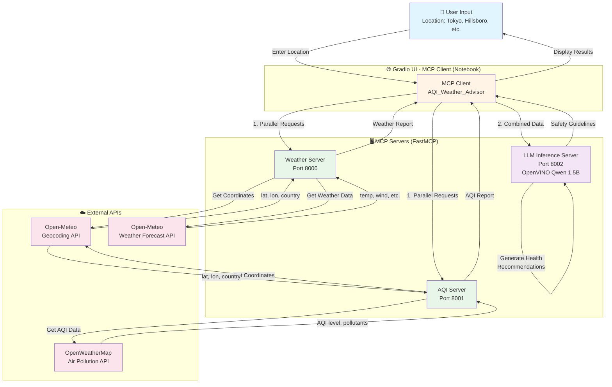

# Weather-AQI MCP Assistant
## Introduction
The sample **`Weather-AQI MCP Assistant`** is an interactive, asynchronous assistant that brings together real-time weather and AQI (Air Quality Index) data using powerful **MCP** (Model Context Protocol) servers.
There are 3 MCP servers used in this sample which are created using **`FastMCP`** which is a high-level, Pythonic framework inspired by FastAPI that simplifies MCP implementation.\
It seamlessly connects to dedicated weather and AQI tools on **Intel® Core™ Ultra Processors** then uses [**Qwen/Qwen2.5-3B-Instruct**](https://huggingface.co/Qwen/Qwen2.5-3B-Instruct) to analyze the data and generate clear, actionable health and safety recommendations. The Qwen2.5-3B-Instruct model is loaded using the [**PyTorch XPU backend**](https://docs.pytorch.org/docs/stable/notes/get_start_xpu.html) to leverage Intel hardware acceleration.\
This assistant helps users stay informed about environmental conditions and make better decisions for their well-being. Designed with async operations and SSE connections, it’s perfect for modern, event-driven pipelines.


## Table of Contents

- [Sample Workflow](#sample-workflow)
- [Project Structure](#project-structure)
- [Weather & AQI Data Requirements](#weather--aqi-data-requirements)
- [Pre-requisites](#pre-requisites)
- [Installing Prerequisites && Setting Up the Environment](#installing-prerequisites--setting-up-the-environment)
   - [For Windows](#for-windows)
   - [For Linux](#for-linux)
- [Running the Sample && execution output](#running-the-sample--execution-output)
- [Troubleshooting](#troubleshooting)
---

## Sample Workflow

This diagram illustrates how the WeatherAQI MCP Assistant operates end-to-end within an AI PC environment, combining MCP Compliant Servers, an MCP client, and external APIs.
The servers are created using FastMCP which is a high-level, Pythonic framework inspired by FastAPI that simplifies MCP implementation and make it much easier to build MCP servers and clients.

**User input:**
   - User enters the desired location name (e.g. "Tokyo") to get the weather and AQI data of that particular area. MCP Client (Weather & AQI Advisory) uses this input and sends this to two different MCP servers.
     
**Air Quality Index MCP server:**
   - The location received from the MCP client is converted to corresponding latitude and longitude using [geocoding API](https://open-meteo.com/en/docs/geocoding-api) which in turn used by the air pollution API.
   - The Air Quality Index (AQI) server uses the latitude and longitude parameters received from the above mentioned geocoding API to make an API call to [OpenWeatherMap Air Pollution API](https://openweathermap.org/api/air-pollution) to get AQI data and pollutant levels. This AQI data is returned to the MCP client.

**Weather MCP server:**
   - The location received from the MCP client is converted to corresponding latitude and longitude using [geocoding API](https://open-meteo.com/en/docs/geocoding-api) which in turn used by the weather forecast API.
   - The Weather server uses the latitude and longitude parameters received from the above mentioned geocoding API to make an API call to the [Open-Meteo Weather Forecast API](https://open-meteo.com/en/docs#api_response) to get current temperature, wind speed, and other weather details. This weather data is also returned to the MCP client.

**LLM Inferencing MCP server:**
   - The MCP client then passes both the weather and AQI reports to the LLM (large language model) Inferencing server. The LLM generates personalized safety guidelines based on the combined information.

**Final result:**
   - The final output from the LLM (e.g., safety advice, health risks, and precautions) is sent back to the MCP client, which presents it to the user.



**Workflow Details:**
- **Step 1:** Weather and AQI requests run in parallel (~2-3 seconds)
- **Step 2:** Combined reports sent to LLM for analysis (~20-30 seconds)
- **Total Time:** ~25-35 seconds end-to-end

---

## Project Structure

    Weather-AQI MCP Assistant/                                             # Project Sample folder
    ├── assets/                                                            # Assets folder which contains the images and diagrams
    │   ├── Generating_safety_guidelines_using_Pytorch_XPU.png             # Output screenshot image 1
    │   ├── WeatherAQI_MCP_Assistant_Workflow.png                          # Workflow image
    │   └── safety_measures.png                                            # Output screenshot image 2
    ├── mcp_servers/                                                       # MCP server implementations
    │   ├── 1_weather_server.py                                            # Weather data MCP server
    │   ├── 2_Air_Quality_Index_server.py                                  # Air Quality Index MCP server
    │   ├── 4_LLM_Inference_server.py                                      # LLM inference MCP server (OpenVINO optimized)
    │   ├── 8_smart_city.py                                                # Smart city MCP server (additional)
    │   └── 9_LLM_OV_Server.py                                             # Alternative LLM server (additional)
    ├── utilities/                                                         # Test and utility scripts
    │   ├── test_data_formats.py                                           # Validates Weather/AQI output formats
    │   ├── test_llm.py                                                    # End-to-end LLM testing with hardcoded data
    │   └── test_llm_connection.py                                         # LLM server connection testing
    ├── config.yaml                                                        # Central configuration file
    ├── utils.py                                                           # Shared utilities (geocoding, logging, config)
    ├── start_mcp_servers_for_nb_1.py                                      # Server orchestration tool
    ├── README.md                                                          # Project documentation
    ├── 1_Weather_AQI_MCP_Assistant.ipynb                                  # Main Gradio notebook for the assistant
    ├── pyproject.toml                                                     # Project dependencies
    └── uv.lock                                                            # Locked dependency versions

---

## Weather & AQI Data Requirements

This project uses two public APIs to provide real-time weather and air quality information:
  1. **Open-Meteo API**\
     Purpose:
      - Geocoding: Convert a city or place name into coordinates (latitude & longitude).
      - Weather Forecast: Get current weather data (temperature, wind speed, etc.)
      
     Usage:
      - No API key required! Open-Meteo is free for testing and development.
  2. **OpenWeatherMap API**\
     Purpose:
      - Provides Air Quality Index (AQI) and detailed pollutant data for any coordinates
      - An API key is required to access the AQI endpoints.
     
     Usage:
      - OpenWeatherMap requires an API key for all AQI endpoints.
     
     To get API key:
      - Sign up [here](https://home.openweathermap.org/users/sign_in)
      - Log in and go to API keys in your account dashboard.
      - Copy your key.
     
     Add it to the project:
      - Create a .env file in your project root:
      ```
      AQI_API_KEY=<aqi_key>
      ```
> **NOTE**: API activation could take couple of hours. Immediate usage might lead to errors (e.g."cod":401, "message": "Invalid API key).
---

## Pre-requisites

|    Component   |   Recommended   |
|   ------   |   ------   |
|   Operating System(OS)   |   Windows 11 or later/ Ubuntu 20.04 or later   |
|   Random-access memory(RAM)   |   32 GB   |
|   Hardware   |   Intel® Core™ Ultra Processors, Intel Arc™ Graphics, Intel Graphics  |

---

## Installing Prerequisites && Setting Up the Environment

### For Windows:
To install any software using commands, Open the Command Prompt as an administrator by right-clicking the terminal icon and selecting `Run as administrator`.
1. **GPU Drivers installation**\
   Download and install the Intel® Graphics Driver for Intel® Arc™ B-Series, A-Series, Intel® Iris® Xe Graphics, and Intel® Core™ Ultra Processors with Intel® Arc™ Graphics from [here](https://www.intel.com/content/www/us/en/download/785597/intel-arc-iris-xe-graphics-windows.html)\
   **IMPORTANT:** Reboot the system after the installation.

2. **Git for Windows**\
   Download and install Git from [here](https://git-scm.com/downloads/win)

3. **uv for Windows**\
   Steps to install `uv` in the Command Prompt are as follows. Please refer to the [documentation](https://docs.astral.sh/uv/getting-started/installation/) for more information.
   ```
   powershell -ExecutionPolicy ByPass -c "irm https://astral.sh/uv/install.ps1 | iex"
   ```
   **NOTE:** Close and reopen the Command Prompt to recognize uv.
   
### For Linux:
To install any software using commands, Open a new terminal window by right-clicking the terminal and selecting `New Window`.
1. **GPU Drivers installation**\
   Download and install the GPU drivers from [here](https://dgpu-docs.intel.com/driver/client/overview.html)

2. **Dependencies on Linux**\
   Install Curl, Wget, Git using the following commands:
   - For Debian/Ubuntu-based systems:
   ```
   sudo apt update && sudo apt -y install curl wget git
   ```
   - For RHEL/CentOS-based systems:
   ```
   sudo dnf update && sudo dnf -y install curl wget git
   ```

3. **uv for Linux**\
   Steps to install uv are as follows. Please refer to the [documentation](https://docs.astral.sh/uv/getting-started/installation/) for more information.
   - If you want to use curl to download the script and execute it with sh:
   ```
   curl -LsSf https://astral.sh/uv/install.sh | sh
   ```
   - If you want to use wget to download the script and execute it with sh:
   ```
   wget -qO- https://astral.sh/uv/install.sh | sh
   ```
   **NOTE:** Close and reopen the Terminal to recognize uv.

---

## Running the Weather, AQI, and LLM MCP Assistant
   
1. In the Command Prompt/terminal, navigate to `MCP_Agent` folder after cloning the sample:

   
2. Log in to Hugging Face, generate a token, and download the required model:\

   `huggingface-cli` lets you interact directly with the Hugging Face Hub from a terminal. Log in to [Huggingface](https://huggingface.co/) with your credentials. You need a [User Access Token](https://huggingface.co/docs/hub/security-tokens) from your [Settings page](https://huggingface.co/settings/tokens). The User Access Token is used to authenticate your identity to the Hub.\
   Once you have your token, run the following command in your terminal.
   ```
   uv run huggingface-cli login
   ```
   This command will prompt you for a token. Copy-paste yours and press Enter.
   ```
   uv run huggingface-cli download OpenVINO/qwen2.5-1.5b-instruct-int8-ov
   ```
   This downloads the OpenVINO-optimized INT8 quantized model for faster inference on Intel hardware.
3. Run all MCP servers locally:

   This sample has 3 MCP servers (runs on 3 different ports):
     - **Weather** (port no - 8000)
     - **AQI (Air Quality Index)** (port no - 8001)
     - **LLM (Large Language Model) Inference** (port no - 8002)
  
   **Use Server Manager**
   
   Launch all servers with a single command:
   ```
   uv run python start_mcp_servers_for_nb_1.py
   ```
   This will start all three servers automatically. Press `Ctrl+C` to gracefully shutdown all servers.


4. Launch Jupyter Lab and Run the notebook from a new terminal window:
   
   ```
   uv run jupyter lab
   ```
   
   Open the [1_Weather-AQI MCP Assistant](./1_Weather_AQI_MCP_Assistant.ipynb) notebook in the Jupyter Lab.
   - In the Jupyter Lab go to the kernel menu in the top-right corner of the notebook interface and choose default kernel i.e. `aqi` from the available kernels list and run the code cells one by one in the notebook.


6. GPU utilization can be seen in the Task Manager while generating safety guidelines for the requested location which are processing on Intel XPUs.
   

7. Based on the weather and AQI report in the requested location, the model generates safety guidelines.
   

---

## Configuration

Edit `config.yaml` to customize server settings:

```yaml
servers:
  weather:
    port: 8000  # Change server ports
  aqi:
    port: 8001
  llm:
    port: 8002

timeouts:
  http_request: 10  # Adjust API timeouts

logging:
  level: "INFO"  # Change to DEBUG for verbose output
```

## Performance Optimizations

The LLM inference server has been optimized for reliability and performance:

- **Token Limit:** Set to 500 tokens for complete responses without system overload

- **Typical Performance:**
  - Weather + AQI fetch: ~2-3 seconds (parallel)
  - LLM inference: ~20-30 seconds
  - Total end-to-end: ~25-35 seconds

## Troubleshooting

- **Dependency Issues:** Run `uv clean` and then `uv sync`.
- **File Access Issues:** Restart the kernel and run the cells again.
- **API_KEY Issues:** Make sure the API_KEY for openweathermap is activated before using it.
- **Servers won't start:** Check if ports 8000-8002 are already in use, verify UV environment with `uv sync`
- **Import errors:** After adding new dependencies, run `uv sync` to install them
- **LLM hangs or crashes:** Ensure you're using the correct OpenVINO model (qwen2.5-1.5b-instruct-int8-ov)
- **Connection timeouts:** The LLM server may take 30-60 seconds on first run while loading the model
- **Testing utilities:** Use scripts in `utilities/` folder to validate individual components

---

